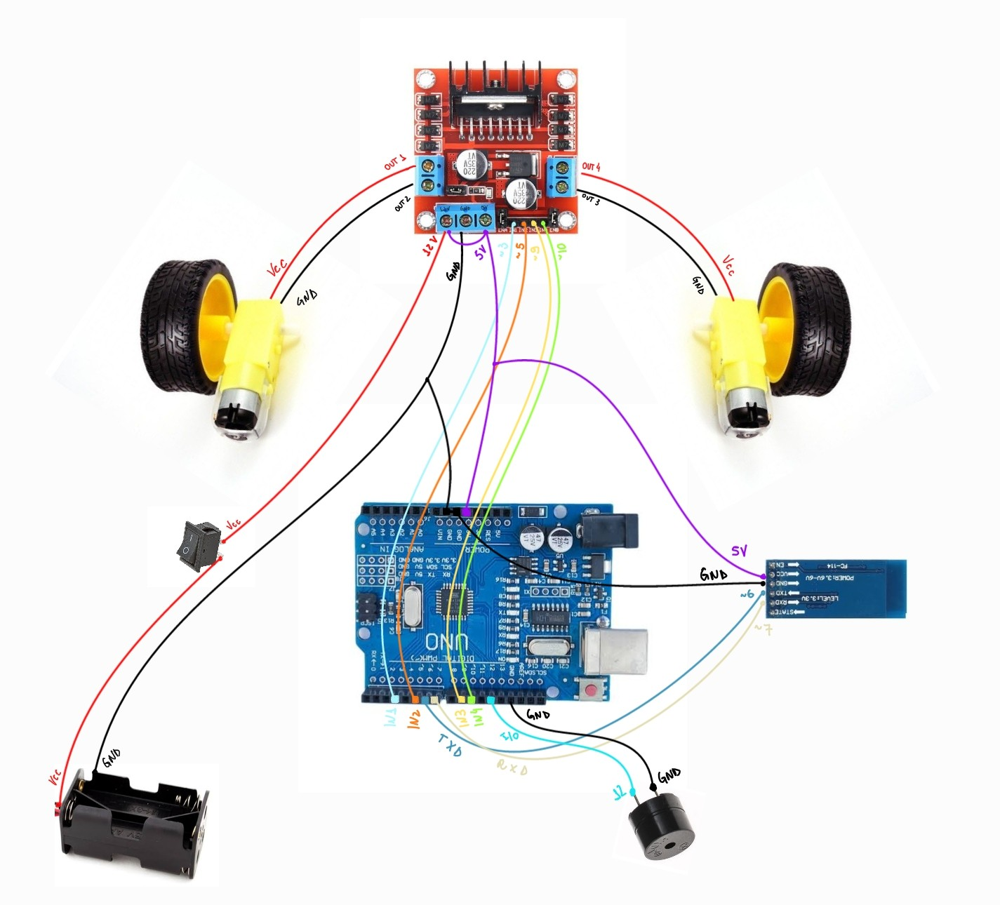
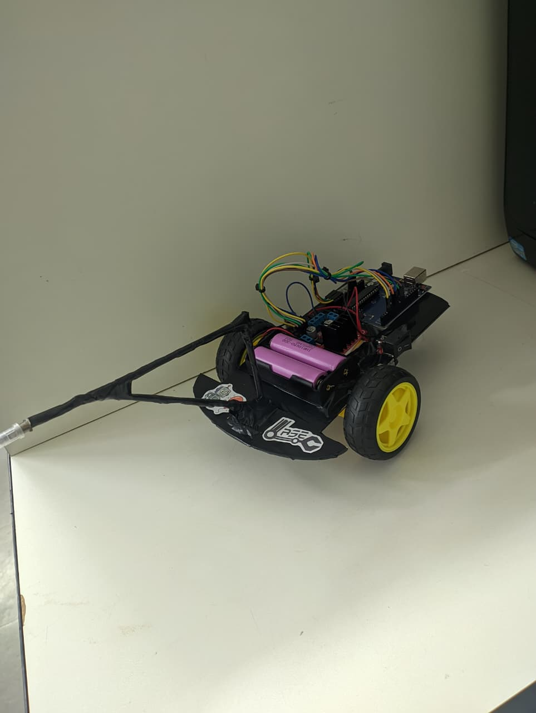
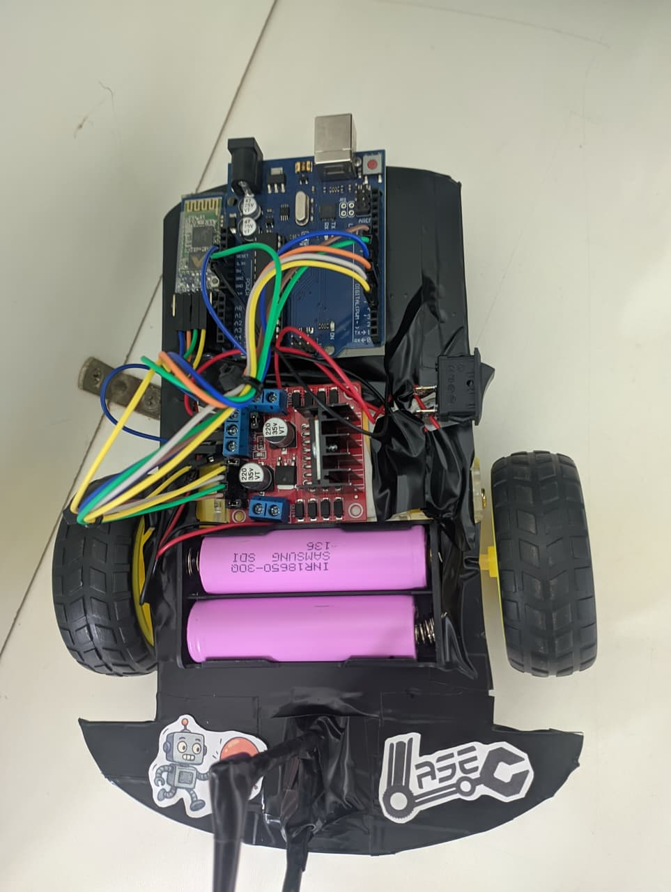

# 🎮 Robô de Controle Remoto via App Mobile — Iniciação Científica UFU (2025)

🤖 Este repositório apresenta um dos projetos desenvolvidos durante minha **Iniciação Científica** no **Laboratório de Automação, Sistemas Eletrônicos e Controle da Universidade Federal de Uberlândia (UFU)**.  
O trabalho foi realizado a partir de uma proposta orientada pela professora responsável pela pesquisa.

---

## 💡 Sobre o Projeto

A Iniciação Científica teve como tema:  
> *"Desenvolvimento de Robôs Inteligentes: do Sumô Autônomo ao Controle via Aplicativo"*

O objetivo central da pesquisa foi desenvolver **três tipos de robôs autônomos** de **fácil montagem** e **alta dinamicidade**, voltados à **capacitação de professores da rede estadual de ensino**.  
A ideia era permitir que os docentes pudessem montar e programar os robôs junto a seus alunos do novo ensino médio, utilizando os kits de materiais já disponibilizados pelas escolas.

Este repositório documenta o **Robô de Controle Remoto via Aplicativo**, que possui funções dinâmicas e é controlado remotamente através do software **Dabble** — compatível com o **Arduino IDE** por meio de sua biblioteca oficial.

### 🔧 Componentes Utilizados
- 1 × Controlador **Arduino UNO**  
- 1 × Ponte H **L298N**  
- 1 × Módulo **Bluetooth HC-05**  
- 1 × **Botão** liga/desliga  
- 1 × **Módulo buzzer** ativo 5V  
- 1 × **Suporte** para 2 baterias de lítio 3.7V  
- 2 × **Motores DC** com rodas  

---

## 🛠️ Tecnologias Utilizadas

- [Arduino IDE](https://www.arduino.cc/en/software/)
- [Arduino Docs — Dabble Library](https://docs.arduino.cc/libraries/dabble/)

---

## 📂 Estrutura do Repositório

| Arquivo | Descrição |
|----------|------------|
| `roboControleRemoto.ino` | Código-fonte principal desenvolvido na Arduino IDE |
| `schemaRoboControleRemoto.png` | Esquema elétrico do circuito de montagem do robô |

---

## ✅ Resultado

   
  <em>Figura 1 — Esquema de conexões elétricas do robô.</em>

   
  <em>Figura 2 — Esquema de conexões elétricas no robô montado.</em>

   
  <em>Figura 3 — Robô Montado.</em>

---

## </> Desenvolvimento

📘 **Autor:** [Vitor Henrique Morais](https://github.com/Vhcmorais)  
🏫 **Instituição:** Universidade Federal de Uberlândia — UFU  
🧭 **Laboratório:** Automação, Sistemas Eletrônicos e Controle  

   

